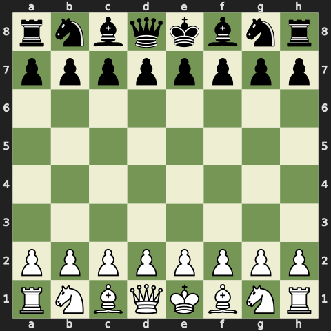

# ♟️ Jogo de Xadrez no GitHub Actions

Este é um jogo de xadrez que você joga abrindo Issues!

## Tabuleiro Atual
Vez das: **Pretas**

## Como Jogar
Clique em um dos links abaixo para fazer sua jogada. Isso abrirá uma Issue pré-preenchida. Basta clicar em **"Submit new issue"** para confirmar o movimento.

### Movimentos Legais
- [Ne7](https://github.com/Kaiofprates/krikor-md/issues/new?title=Chess+Move:+Ne7)
- [Nh6](https://github.com/Kaiofprates/krikor-md/issues/new?title=Chess+Move:+Nh6)
- [Nf6](https://github.com/Kaiofprates/krikor-md/issues/new?title=Chess+Move:+Nf6)
- [Be7](https://github.com/Kaiofprates/krikor-md/issues/new?title=Chess+Move:+Be7)
- [Bd6](https://github.com/Kaiofprates/krikor-md/issues/new?title=Chess+Move:+Bd6)
- [Bc5](https://github.com/Kaiofprates/krikor-md/issues/new?title=Chess+Move:+Bc5)
- [Bb4+](https://github.com/Kaiofprates/krikor-md/issues/new?title=Chess+Move:+Bb4+)
- [Ba3](https://github.com/Kaiofprates/krikor-md/issues/new?title=Chess+Move:+Ba3)
- [Ke7](https://github.com/Kaiofprates/krikor-md/issues/new?title=Chess+Move:+Ke7)
- [Qe7](https://github.com/Kaiofprates/krikor-md/issues/new?title=Chess+Move:+Qe7)
- [Qf6](https://github.com/Kaiofprates/krikor-md/issues/new?title=Chess+Move:+Qf6)
- [Qg5](https://github.com/Kaiofprates/krikor-md/issues/new?title=Chess+Move:+Qg5)
- [Qh4](https://github.com/Kaiofprates/krikor-md/issues/new?title=Chess+Move:+Qh4)
- [Nc6](https://github.com/Kaiofprates/krikor-md/issues/new?title=Chess+Move:+Nc6)
- [Na6](https://github.com/Kaiofprates/krikor-md/issues/new?title=Chess+Move:+Na6)
- [exd4](https://github.com/Kaiofprates/krikor-md/issues/new?title=Chess+Move:+exd4)
- [h6](https://github.com/Kaiofprates/krikor-md/issues/new?title=Chess+Move:+h6)
- [g6](https://github.com/Kaiofprates/krikor-md/issues/new?title=Chess+Move:+g6)
- [f6](https://github.com/Kaiofprates/krikor-md/issues/new?title=Chess+Move:+f6)
- [d6](https://github.com/Kaiofprates/krikor-md/issues/new?title=Chess+Move:+d6)
- [c6](https://github.com/Kaiofprates/krikor-md/issues/new?title=Chess+Move:+c6)
- [b6](https://github.com/Kaiofprates/krikor-md/issues/new?title=Chess+Move:+b6)
- [a6](https://github.com/Kaiofprates/krikor-md/issues/new?title=Chess+Move:+a6)
- [e4](https://github.com/Kaiofprates/krikor-md/issues/new?title=Chess+Move:+e4)
- [h5](https://github.com/Kaiofprates/krikor-md/issues/new?title=Chess+Move:+h5)
- [g5](https://github.com/Kaiofprates/krikor-md/issues/new?title=Chess+Move:+g5)
- [f5](https://github.com/Kaiofprates/krikor-md/issues/new?title=Chess+Move:+f5)
- [d5](https://github.com/Kaiofprates/krikor-md/issues/new?title=Chess+Move:+d5)
- [c5](https://github.com/Kaiofprates/krikor-md/issues/new?title=Chess+Move:+c5)
- [b5](https://github.com/Kaiofprates/krikor-md/issues/new?title=Chess+Move:+b5)
- [a5](https://github.com/Kaiofprates/krikor-md/issues/new?title=Chess+Move:+a5)

---
Partida em andamento. Última atualização: rnbqkbnr/pppp1ppp/8/4p3/3P4/5N2/PPP1PPPP/RNBQKB1R b KQkq - 1 2
